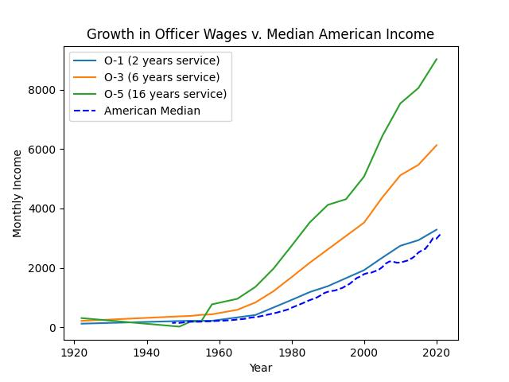
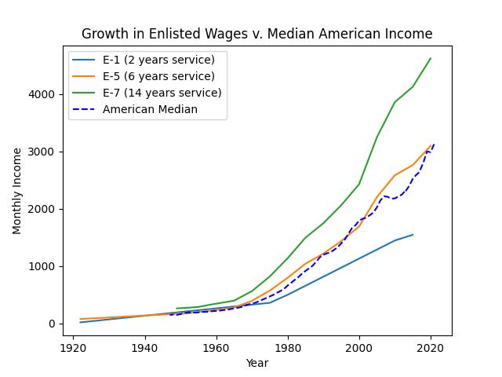
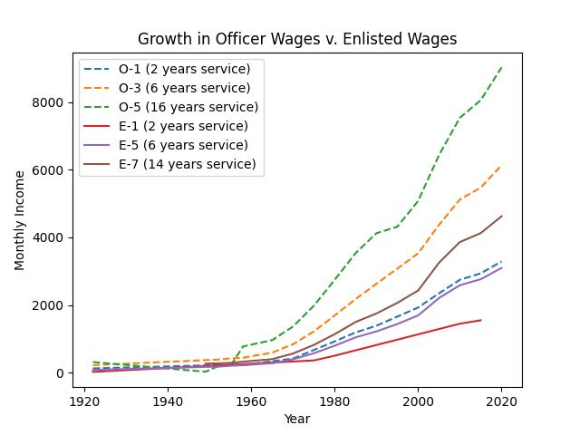

The Army has changed as an employer significantly over the course of the 20th century. It transitioned from a smaller professional Army with a draft to an all-volunteer force. I was curious how, if at all, this change has reflected in wages.

I'll start with the conclusion. Looking solely at wages, being in the military is a pretty good gig, and always has been. Wages for a private (newly enlisted) are about equal to median American wages. For non-comissioned officers and officers, they are well above the median. Moreover, servicemembers' wages increase with the average American wage. Keep in mind, this doesn't include benefits like provided housing or healthcare, which can comprise a large share of military compensation. Admittedly, it also doesn't include the additional hardships that come with military service. Still, from a financial standpoint, servicemembers do pretty well compared to the average American.

## How have wages changed
Wages have largely kept pace with median American wages. A fresh lieutenant (O-1) starts off at the median wage and this has always been true. For mid-career captains (O-3), they make well above the median wage and the gap has widened. The same is true for a lieutenant colonel (O-5) with 16 years of service. They make roughly three times the median wage today.

### Officers

### Enlisted
The enlisted story is much the same. A private fresh into the military does not make a whole lot. They are well below the median wage but that is not particularly unreasonable, as a private enters the military with often little schooling or work experience. The early career sergeant (E-5) with 6 years experience makes about the median wage. Finally, a late-career sergeant first class (E-7) makes well above the median wage and this gap has widened in recent years.

### Officer v. Enlisted
How do officer and enlisted pays compare? Well, for the same amount of experience, officers make more. The main takeaway I'd like to point out is that while wage increases have been fairly consistent for junior officers and enlisted, **more senior military personnel have seen steeper wage increases in recent years.** That is, junior servicemembers pay increases have kept pace with the rise in median wages, but senior servicemembers have widened the gap between them and the average American.

## A Complaint About Data
This analysis is pretty basic, and you might think it can be done quickly by anyone who's taken an introductory statistics course. You would be wrong! The analysis is indeed simple, but the data is stored in an excruciatingly painful and extremely Army way. 

For every year going back to the 1950s, military pay tables are saved as PDFs. Take a look at the [table for 1965](https://www.dfas.mil/Portals/98/MilPayTable1965.pdf). Ok, so you just parse. No! The format for the PDF changes every few years! It is absolute madness. All this is to explain that I had to manually pull the wages from each PDF. This is why I only did every five years, and even that took forever.

I'm sure this data is available in a user-friendly way somewhere, but I didn't know who to ask.

On the bright side, the [wage data](https://www.census.gov/data/tables/time-series/demo/income-poverty/historical-income-people.html) was pleasant to work with (it came as a spreadsheet). Shout out to Table P-2 from the Census Historical Income Tables.
